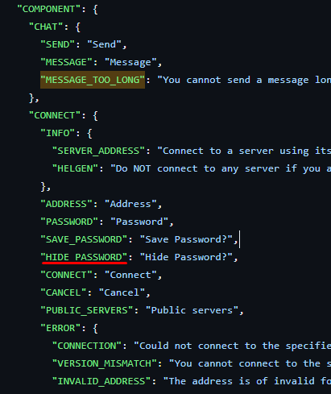

# Contributing to translations


Follow the linked guide first to set up the project.



[build-guide](build-guide/)


***


Be sure to create the new file while using(checked out) the DEV branch, not MASTER.


Duplicate the en.json and adjust its file name according to the wanted language code, e.g. da.json (Danish)




You can find the language codes on this page or by using google e.g. "danish language code"

[http://www.lingoes.net/en/translator/langcode.htm](http://www.lingoes.net/en/translator/langcode.htm)


Then translate all strings in the file.


Do not change the key words such as the underline and similar coloured in green. 


Then create a pull request like [https://github.com/tiltedphoques/TiltedEvolution/pull/573](https://github.com/tiltedphoques/TiltedEvolution/pull/573) with your new localisation file.

